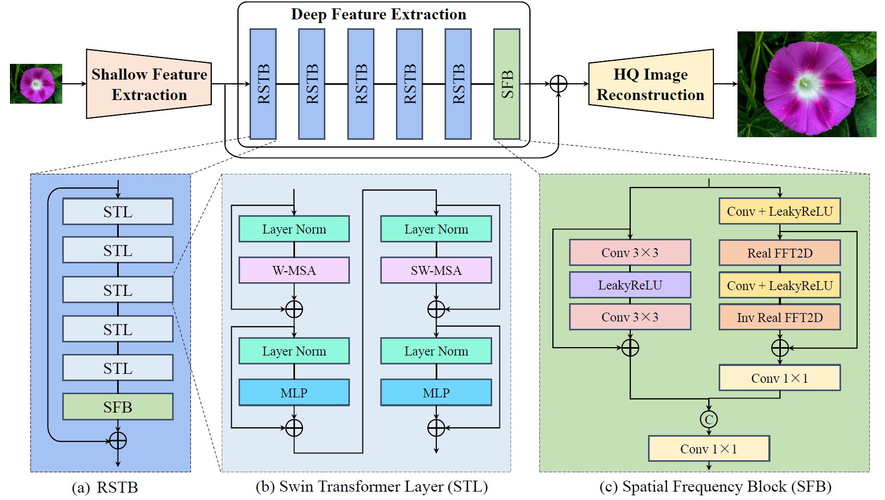

[](https://paperswithcode.com/sota/image-super-resolution-on-set5-2x-upscaling?p=swinfir-revisiting-the-swinir-with-fast)
[](https://paperswithcode.com/sota/image-super-resolution-on-set5-3x-upscaling?p=swinfir-revisiting-the-swinir-with-fast)
[](https://paperswithcode.com/sota/image-super-resolution-on-set5-4x-upscaling?p=swinfir-revisiting-the-swinir-with-fast)
[](https://paperswithcode.com/sota/image-super-resolution-on-set14-2x-upscaling?p=swinfir-revisiting-the-swinir-with-fast)
[](https://paperswithcode.com/sota/image-super-resolution-on-set14-3x-upscaling?p=swinfir-revisiting-the-swinir-with-fast)
[](https://paperswithcode.com/sota/image-super-resolution-on-set14-4x-upscaling?p=swinfir-revisiting-the-swinir-with-fast)
[](https://paperswithcode.com/sota/iimage-super-resolution-on-bsd100-2x-upscaling?p=swinfir-revisiting-the-swinir-with-fast)
[](https://paperswithcode.com/sota/iimage-super-resolution-on-bsd100-3x-upscaling?p=swinfir-revisiting-the-swinir-with-fast)
[](https://paperswithcode.com/sota/iimage-super-resolution-on-bsd100-4x-upscaling?p=swinfir-revisiting-the-swinir-with-fast)
[](https://paperswithcode.com/sota/image-super-resolution-on-urban100-2x?p=swinfir-revisiting-the-swinir-with-fast)
[](https://paperswithcode.com/sota/image-super-resolution-on-urban100-3x?p=swinfir-revisiting-the-swinir-with-fast)
[](https://paperswithcode.com/sota/image-super-resolution-on-urban100-4x?p=swinfir-revisiting-the-swinir-with-fast)
[](https://paperswithcode.com/sota/image-super-resolution-on-manga109-2x?p=swinfir-revisiting-the-swinir-with-fast)
[](https://paperswithcode.com/sota/image-super-resolution-on-manga109-3x?p=swinfir-revisiting-the-swinir-with-fast)
[](https://paperswithcode.com/sota/image-super-resolution-on-manga109-4x?p=swinfir-revisiting-the-swinir-with-fast)
[](https://paperswithcode.com/sota/stereo-image-super-resolution-on-flickr1024-1?p=swinfir-revisiting-the-swinir-with-fast)
[](https://paperswithcode.com/sota/stereo-image-super-resolution-on-flickr1024-2?p=swinfir-revisiting-the-swinir-with-fast)
[](https://paperswithcode.com/sota/stereo-image-super-resolution-on-kitti2012-2x-2?p=swinfir-revisiting-the-swinir-with-fast)
[](https://paperswithcode.com/sota/stereo-image-super-resolution-on-kitti2012-4x?p=swinfir-revisiting-the-swinir-with-fast)
[](https://paperswithcode.com/sota/stereo-image-super-resolution-on-kitti2015-2x?p=swinfir-revisiting-the-swinir-with-fast)
[](https://paperswithcode.com/sota/stereo-image-super-resolution-on-kitti2015-4x?p=swinfir-revisiting-the-swinir-with-fast)
[](https://paperswithcode.com/sota/stereo-image-super-resolution-on-middlebury-1?p=swinfir-revisiting-the-swinir-with-fast)
[](https://paperswithcode.com/sota/stereo-image-super-resolution-on-middlebury?p=swinfir-revisiting-the-swinir-with-fast)


# SwinFIR: Revisiting the SwinIR with Fast Fourier Convolution and Improved Training for Image Super-Resolution

Dafeng Zhang, Feiyu Huang, Shizhuo Liu, Xiaobing Wang and Zhezhu Jin

> Transformer-based methods have achieved impressive image restoration performance due to their capacities to model long-range dependency compared to CNN-based methods. However, advances like SwinIR adopts the window-based and local attention strategy to balance the performance and computational overhead, which restricts employing large receptive fields to capture global information and establish long dependencies in the early layers. To further improve the efficiency of capturing global information, in this work, we propose SwinFIR to extend SwinIR by replacing Fast Fourier Convolution (FFC) components, which have the image-wide receptive field. We also revisit other advanced techniques, i.e., data augmentation, pre-training, and feature ensemble to improve the effect of image reconstruction. And our feature ensemble method enables the performance of the model to be considerably enhanced without increasing the training and testing time. We applied our algorithm on multiple popular large-scale benchmarks and achieved state-of-the-art performance comparing to the existing methods. For example, our SwinFIR achieves the PSNR of 32.83 dB on Manga109 dataset, which is 0.8 dB higher than the state-of-the-art SwinIR method, a significant improvement.

## Architecture


## Environment
- [PyTorch >= 1.7](https://pytorch.org/)
- [BasicSR == 1.3.5](https://github.com/XPixelGroup/BasicSR/blob/master/INSTALL.md) 


### Installation
Install Pytorch first.
Then,
```
pip install -r requirements.txt
python setup.py develop
```

## How To Inference
**Single Image Super Resolution**
``` 
python inference/inference_swinfir.py
```
**Stereo Image Super Resolution**
``` 
python inference/inference_swinfirssr.py
```

## How To Test
**SwinFIR and HATFIR for single image super resolution**

**SwinFIRSSR for stereo image super resolution**

**Single Image Super Resolution**
- Prepare the testing data according to [HAT](https://github.com/XPixelGroup/HAT/tree/main) for single image super resolution.
- Download the pretrained model, [Google Drive](https://drive.google.com/drive/folders/1wiJcFJA4DxIISB7b_qz4u-kA1WE6EJOk?usp=sharing) or [Baidu Netdisk](https://pan.baidu.com/s/1zBVNAqXLMld44G5t0rBG2Q?pwd=8i4g) (access code: 8i4g).
- Then run the follwing codes (taking `SwinFIR_SRx4.yml` as an example):
```
python swinfir/test.py -opt options/test/SwinFIR/SwinFIR_SRx4.yml
```
**Stereo Image Super Resolution**
- Prepare the testing data according to [NAFSSR](https://github.com/megvii-research/NAFNet/blob/main/docs/StereoSR.md) for stereo image super resolution.
- Download the pretrained model, [Google Drive](https://drive.google.com/drive/folders/1wiJcFJA4DxIISB7b_qz4u-kA1WE6EJOk?usp=sharing) or [Baidu Netdisk](https://pan.baidu.com/s/1zBVNAqXLMld44G5t0rBG2Q?pwd=8i4g) (access code: 8i4g).
- Then run the follwing codes (taking `SwinFIRSSR_SSRx4.yml` as an example):
```
python swinfir/test.py -opt options/test/SwinFIRSSR/SwinFIRSSR_SSRx4.yml
```


## How To Train
- Refer to `./options/train` for the configuration file of the model to train.
- Preparation of training data can refer to [this page](https://github.com/XPixelGroup/BasicSR/blob/master/docs/DatasetPreparation.md). ImageNet dataset can be downloaded at the [official website](https://image-net.org/challenges/LSVRC/2012/2012-downloads.php).
- The training command is like
```
CUDA_VISIBLE_DEVICES=0,1,2,3,4,5,6,7 python -m torch.distributed.launch --nproc_per_node=8 --master_port=4321 swinfir/train.py -opt options/train/SwinFIR/train_SwinFIR_SRx2_from_scratch.yml --launcher pytorch
```

The training logs and weights will be saved in the `./experiments` folder.

## Results
- Classical Image Super-Resolution

  |   Method    | Scale | Set5  | Set14 | BSD100 | Urban100 | Manga109 |
  | :---------: | :---: | :---: | :---: | :----: | :------: | :------: |
  |   SwinIR    |  X2   | 38.42 | 34.46 | 32.53  |  33.81   |  39.92   |
  | **SwinFIR** |  X2   | 38.67 | 34.94 | 32.66  |  34.59   |  40.63   |
  |     HAT     |  X2   | 33.73 | 35.13 | 32.69  |  34.81   |  40.71   |
  | **HATFIR**  |  X2   | 38.77 | 35.19 | 32.73  |  34.97   |  40.78   |
  |   SwinIR    |  X3   | 34.97 | 30.93 | 29.46  |  29.75   |  35.12   |
  | **SwinFIR** |  X3   | 35.16 | 31.25 | 29.56  |  30.45   |  35.77   |
  |     HAT     |  X3   | 35.16 | 31.33 | 29.59  |  30.70   |  35.84   |
  | **HATFIR**  |  X3   | 35.22 | 31.37 | 29.61  |  30.78   |  35.91   |
  |   SwinIR    |  X4   | 32.92 | 29.09 | 27.92  |  27.45   |  32.03   |
  | **SwinFIR** |  X4   | 33.20 | 29.36 | 28.03  |  28.14   |  32.84   |
  |     HAT     |  X4   | 33.18 | 29.38 | 28.05  |  28.37   |  32.87   |
  | **HATFIR**  |  X4   | 33.29 | 29.47 | 28.08  |  28.44   |  33.03   |

- Lightweight Image Super-Resolution

  |   Method    | Scale | Set5  | Set14 | BSD100 | Urban100 | Manga109 |
  | :---------: | :---: | :---: | :---: | :----: | :------: | :------: |
  |   SwinIR    |  X2   | 38.14 | 33.86 | 32.31  |  32.76   |  39.12   |
  | **SwinFIR** |  X2   | 38.30 | 34.28 | 32.43  |  33.33   |  39.71   |
  |   SwinIR    |  X3   | 34.62 | 30.54 | 29.20  |  28.66   |  33.98   |
  | **SwinFIR** |  X3   | 34.76 | 30.68 | 29.30  |  29.05   |  34.59   |
  |   SwinIR    |  X4   | 32.44 | 28.77 | 27.69  |  26.47   |  30.92   |
  | **SwinFIR** |  X4   | 32.67 | 28.99 | 27.80  |  26.99   |  31.68   |

- Stereo Image Super-Resolution

  |     Method     | Scale | KITTI 2012 | KITTI 2015 | Middlebury | Flickr 1024 |
  | :------------: | :---: | :--------: | :--------: | :--------: | :---------: |
  |    NAFSSR-L    |  X2   |   31.60    |   31.25    |   35.88    |    29.68    |
  | **SwinFIRSSR** |  X2   |   31.79    |   31.45    |   36.52    |    30.14    |
  |    NAFSSR-L    |  X4   |   27.12    |   26.96    |   30.30    |    24.17    |
  | **SwinFIRSSR** |  X4   |   27.16    |   26.89    |   30.44    |    24.30    |


## Citation
If you find this project useful for your research, please consider citing:
~~~
@article{zhang2022swinfir,
  title={Swinfir: Revisiting the swinir with fast fourier convolution and improved training for image super-resolution},
  author={Zhang, Dafeng and Huang, Feiyu and Liu, Shizhuo and Wang, Xiaobing and Jin, Zhezhu},
  journal={arXiv preprint arXiv:2208.11247},
  year={2022}
}
~~~
## Acknowledgement
This project is mainly based on [BasicSR](https://github.com/XPixelGroup/BasicSR) and [HAT](https://github.com/XPixelGroup/HAT).
